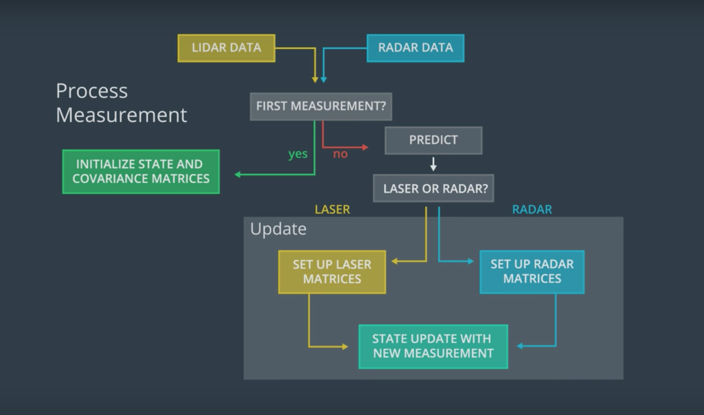
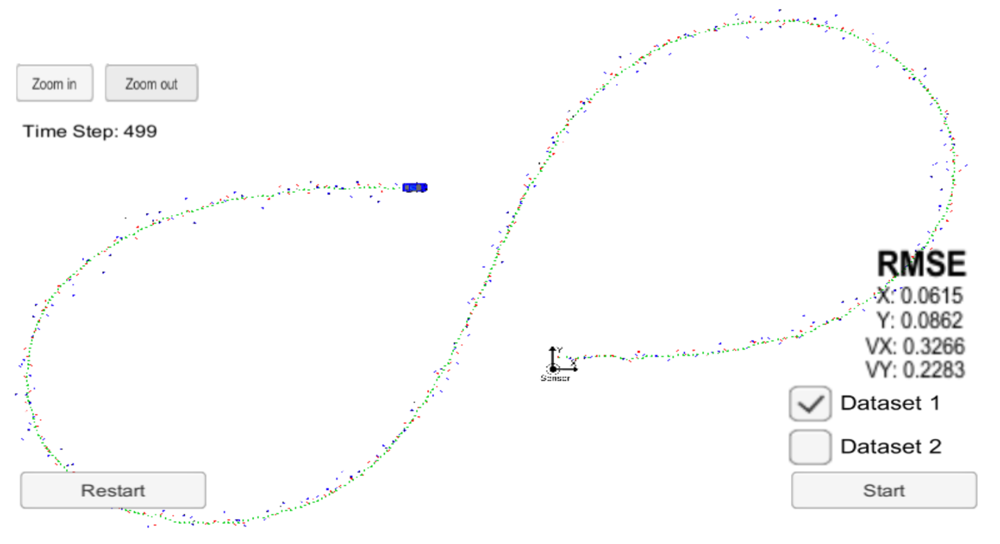
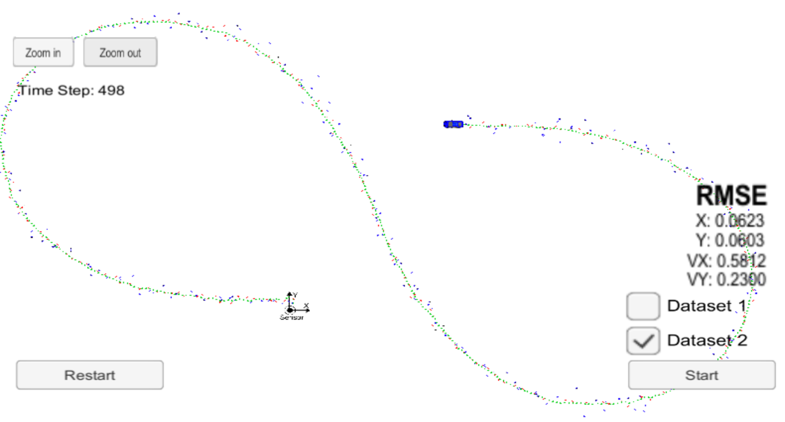

# Unscented Kalman Filter Project

Self-Driving Car Engineer Nanodegree Program

This project implements unscented kalman filter to estimate the state of a moving object of interest with noisy lidar and radar measurements. 

### Concept & Approach

1. Initialize with the very first measurement.
2. On every incoming measurement from LIDAR/RADAR sensor, update prediction matrices using unscented kalman filter and new system state.
3. Compute RMSE, repeat Step 1 with the new error values.

### Implementation

1. Updated `install-mac.sh` to use the correct `openssl` path
2. Implemented Unscented Kalman filter in the class `UKF`, in the file `ukf.cpp`
4. Implemented RMSE calculation function in `tools.cpp`.

### Results & Discussion

Dataset 1

Dataset 2

* The above diagrams show the results when executing the program against the simulator for two different datasets.
* The program has to be restarted when switching between the datasets. _(Scope for improvement)_

Optimization of standard deviation values for longitudinal & yaw acceleration values over Dataset 1

|  std_a_  |  std_yawdd__  |   x      | y      | vx     | vy     |
|----------|---------------|----------|--------|--------|--------|
|  1.5     |  0.5          |   0.0693 | 0.0835 | 0.3336 | 0.2380 |
|  30      |  30           |   0.0976 | 0.1209 | 0.8697 | 0.9845 |
|  15      |  15           |   0.0896 | 0.1100 | 0.6228 | 0.6670 |
|  5       |  5            |   0.0787 | 0.0945 | 0.4187 | 0.3792 |
|  2       |  2            |   0.0702 | 0.0858 | 0.3521 | 0.2693 |
|  1       |  1            |   0.0650 | 0.0840 | 0.3309 | 0.2342 |
|  0.5     |  0.5          |   0.0615 | 0.0862 | 0.3266 | 0.2283 |

### Environment Setup

Install uWebSocketIO for the respective Operating System by following the documentation [here](https://classroom.udacity.com/nanodegrees/nd013/parts/40f38239-66b6-46ec-ae68-03afd8a601c8/modules/0949fca6-b379-42af-a919-ee50aa304e6a/lessons/f758c44c-5e40-4e01-93b5-1a82aa4e044f/concepts/23d376c7-0195-4276-bdf0-e02f1f3c665d)

### Build and Run 

1. Clone this repo.
2. Make a build directory: `mkdir build && cd build`
3. Compile: `cmake .. && make` 
   * On windows, you may need to run: `cmake .. -G "Unix Makefiles" && make`
4. Run it: `./UnscentedKF `
